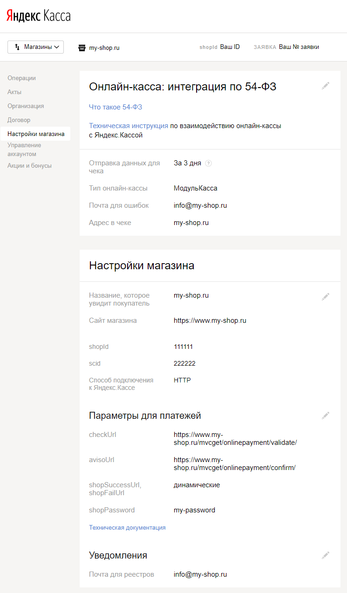
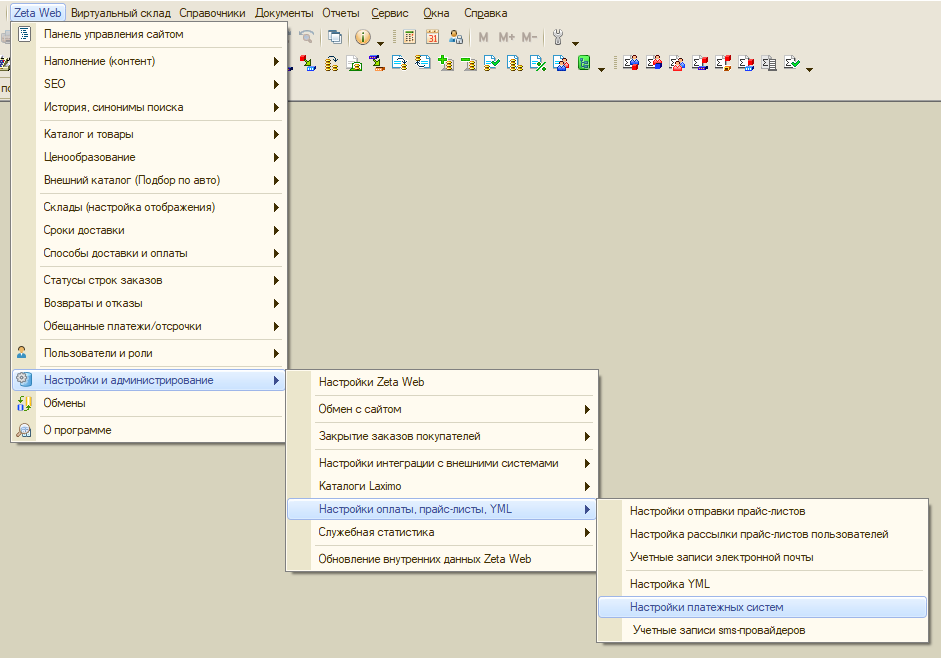

# Поддержка онлайн-платежей

## Виды поддерживаемых сервисов онлайн-платежей

## Яндекс.Касса

Поддерживаемые виды оплат:

* Банковская карта

Поддерживаемые онлайн-кассы \(ФЗ-54\)

* АТОЛ
* Orange Data
* МодульКасса
* Бизнес.Ру Онлайн-Чеки

### Настройка

#### Личный кабинет Яндекс.Касса

В личном кабинете Яндекс.Касса настройте следующие обязательные поля:

* Название сайта _Значение: Полный адрес сайта магазина, включая протокол, например,_ [https://mysite.com](https://mysite.com)
* Способ подключения к Яндекс.Кассе _Значение: **HTTP**_
* chekUrl _Значение:_ [https://{адрес](https://{адрес) _**вашего сайта}/mvcget/onlinepayment/validate/**, где {адрес вашего сайта}, например, **mysite.com**_
* avisoUrl _Значение:_ [https://{адрес](https://{адрес) _**вашего сайта}/mvcget/onlinepayment/confirm/,** где {адрес вашего сайта}, например, **mysite.com**_
* shopSuccessUrl, shopFailUrl _Значение: **dynamic**_
* shopPassword _Значение: Любой **пароль** \(в дальнейшем он понадбится при настройке 1С\)_
* Почта для реестров _Значение: Адрес электронной почты, на которую будут высылаться ежедневные реестры по проведенным платежам_

#### 1С Предприятие

Если ваша онлайн-касса поддерживает интеграцию с Яндекс.Кассой, также заполните следующие параметры

* Отправка данныз для чека _Значение: Время в днях, отведенное на отправку данных об электронном чеке, например, **3 дня**_
* Тип онлайн кассы _Значение: Тип вашей онлайн-кассы, например, **МодульКасса**_
* Почта для ошибок _Значение: Адрес электронной почты, на который будут отправляться уведомления в случае возникновения ошибок_
* Адрес в чеке _Значение: Адрес сайта, отображаемый в чеке, например, **mysite.com**_

В меню 1С Прелприятие откройте форму настроек платежных систем

В открывшейся форме добавьте новый элемент и заполните следующие поля:

* Наименование  Значение: _Произвольное, понятное вам название настройки_
* Платежная система _Значение: **Яндекс.Деньги**_
* Договор эквайринга  _Значение: Существующий или создайте новый договор эквайринга с поставщиком._ 
* Идентификатор магазина _Значение: Значение настройки **shopId**, выданной вам компанией Яндекс.Касса_
* Идентификатор витрины магазина _Значение: Значение настройки **scid**, выданной вам компанией_ Яндекс.Касса
* Логин _Значение: Оставьте это поле **пустым**_
* Пароль _Значение: **Пароль**, указанный в натсройках магазина в личном кабинете Яндекс.Касса_
* Требуется защищенное соединение _Значение: **Да**_
* Тестовый режим оплаты: _Значение: **Да** - в режиме тестирования; **Нет** - в режиме реальной работы_
* Адрес платежного шлюза \(URL\) _Значение: Оставьте это поле **пустым**_
* Список видов оплат _Значение: Добавьте в список предопределенный вид оплаты **Банковской картой на сайте**, затем октройте данный вид оплаты на редактирование и укажите в нем требуемый **Вид оплаты чека ККМ**, который будет подставляться в документ **Оплата от покупателя платежной картой**_

Если ваша онлайн-касса поддерживает интеграцию с Яндекс.Кассой, также заполните следующие параметры:

* Использовать онлайн-кассу _Значение: **Да**_
* Идентификатор клиента для онлайн-кассы по умолчанию _Значение: **Саначала телефон** - если необходимо высылать данные об электронном чеке в виде SMS; **Сначала электронная почта** - если необходимо высылать данные об электронном чеке на электронную почту покупателя._

## ASSIST

Поддерживаемые виды оплат:

* Банковская карта

Поддержка онлайн-касс не предусмотрена

### Настройка

#### 1С Предприятие {#1s-predpriyatie-assist}

Откройте настройки платежных систем как описано [выше](podderzhka-onlain-platezhei.md#1s-predpriyatie)

В открывшейся форме добавьте новый элемент и заполните следующие поля:

* Наименование  Значение: _Произвольное, понятное вам название настройки_
* Платежная система _Значение: **Assist**_
* Договор эквайринга  _Значение: Укажите существующий или создайте новый договор эквайринга с поставщиком._ 
* Идентификатор магазина _Значение: Значение настройки **Merchant ID** \(**ShopId\)**, выданной вами компанией ASSIST_
* Идентификатор витрины магазина _Значение: Оставьте это поле **пустым**_
* Логин _Значение: **Логин**, указанный при регистрации в системе ASSIST_
* Пароль _Значение: **Пароль**, указанный при регистрации в системе ASSIST_
* Требуется защищенное соединение _Значение: **Нет**_
* Тестовый режим оплаты: _Значение: **Да** - в режиме тестирования; **Нет** - в режиме реальной работы_
* Адрес платежного шлюза \(URL\) _Значение: Адрес домена для проведения платежей, предоставленный компанией ASSIST, например,_ **payments173.paysecure.ru**
* Список видов оплат _Значение: Добавьте в список предопределенный вид оплаты **Банковской картой на сайте**, затем октройте данный вид оплаты на редактирование и укажите в нем требуемый **Вид оплаты чека ККМ**, который будет подставляться в документ **Оплата от покупателя платежной картой**_

