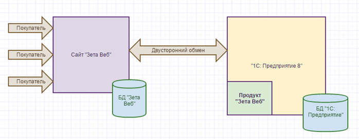

# Возвраты и отказы


Система "Возвраты и отказы" - это дополнительный модуль для решения Zeta Web, предназначенный для работы со строками созданного заказа. Доступен для конфигурации 1С Управление торговлей ред. 10.3


Если пользователь уже оформил заказ на сайте, но затем ему необходимо отменить определенную позицию из заказа \(например, неправильно выбрал товар, или указал неверное количество\), то он может оформить заявку на отмену на сайте, со страницы Заказы – Журнал по заказам.

Также, если по заказу была оформлена реализация, пользователь может на сайте оформить заявку на возврат товаров.

## Работа пользователя на сайте

### Оформление заявки на отмену заказа

В стандартных настройках статусов отмена возможна, если строка заказа находится в статусах «\_Сайт - Отправлен менеджеру» \(В обработке\), «02. Приостановлен \(ожидает оплаты\)», «07. Зарезервирован на складе выдачи».

Возможность делать заявки на отмену/возврат, из разных статусов заказов, настраивается в справочнике «Статусы строки заказа \(Zeta Web\)» \(подробнее о ["Статусах строк заказов](statusy-strok-zakazov.md)"\).


На сайте оформляется не сама отмена строк, а ЗАЯВКА на отмену от пользователя.


Для создания заявки на отмену на странице «Заказы» в «Журнале по заказам» раскройте информацию о заказе.

В детальных записях по заказу нажмите ссылку «Отмена позиции из заказа». На скриншоте ниже пример отображения в дизайне \(данный вариант используется в типовом дизайне\).

На странице «Отмена позиции заказа» укажите количество товара для отмены и комментарий \(при необходимости\). Доступное количество — это максимальное количество для отмены из заказа. Для оформления заявки на отмену нажмите кнопку «Подать заявку».  

После создания заявки на отмену Вы увидите сообщение об успешном добавлении заявки.

В «Журнале по заказам» добавится информация об отмене позиции.

### Оформление заявки на возврат товара

В стандартных настройках статусов возврат возможен, если строка заказа находится в статусе «10. Товар отгружен». Возможность делать заявки на отмену/возврат из разных статусов заказов, настраивается в справочнике «Статусы строки заказа \(Zeta Web\)»

Для оформления заявки на возврат на странице «Заказы» в «Журнале по заказам» раскройте информацию о заказе. В детальных записях по заказу нажмите ссылку «Возврат позиции из заказа». На скриншоте ниже пример отображения в дизайне \(данный вариант используется в типовом дизайне\).

На странице «Возврат позиции заказа» укажите количество товара для возврата, а также выберите причину возврата и уточнение причины. Также вы можете прикрепить файл и написать комментарий для менеджера.

Проверьте данные и нажмите кнопку «Подать заявку». После создания заявки пользователь будет перенаправлен на страницу «Заказы».

### Журнал возвратов

На странице журнала возвратов вы можете просмотреть статусы заявок на отмену или возврат товара, скачать сопроводительную записку или прикреплённые файлы.

Для удобства вы можете воспользоваться фильтрами:

* По дате;
* По типу заявки;
* По статусу;
* По заказчику;
* По производителю;
* По артикулу;
* По наименованию.

Заполните поля и нажмите кнопку «Отбор».

## Работа менеджера в 1С

### Настройка в 1С

#### Справочник «Статусы запроса на отмену строки \(Zeta Web\)»

Выберите пункт меню  Zeta Web → Возвраты и отказы → Статусы запроса на отмену строки.

Для добавления нового статуса нажмите кнопку «Добавить». На форме создания новой записи заполните соответствующие поля:

* Наименование;
* WEBЦвет статуса.

А также установите/снимите флажок «Доступен ввод на основании документов». Если данный флаг установлен, то по заявке, находящейся в данном статусе, возможно создание соответствующего документа для отмены строк.

Для сохранения нажмите кнопку «ОК».

#### Справочник «Статусы заявки на возврат товара \(Zeta Web\)».

Выберите пункт меню Zeta Web → Возвраты и отказы → Статусы заявки на возврат товара.

Для добавления нового статуса нажмите кнопку «Добавить». На форме создания новой записи заполните соответствующие поля:

* Наименование;
* WEBЦвет статуса.

А также установите/снимите флажок «Доступен ввод на основании документов». Если данный флаг установлен, то по заявке, находящейся в данном статусе, возможно создание соответствующего документа возврата.

Для сохранения нажмите кнопку «ОК».

#### Справочник «Причины возврата товаров \(Zeta Web\)»

Выберите пункт меню Zeta Web → Возвраты и отказы → Причины возврата товаров.

 
Для добавления новой причины нажмите кнопку «Добавить» и на форме создания записи укажите наименование. Для сохранения нажмите кнопку «ОК».

#### Справочник «Дополнительные описания причины возврата товаров \(Zeta Web\)»

Выберите пункт меню Zeta Web → Возвраты и отказы → Дополнительные описания причин возврата товаров.

 
Для добавления нового описания причины возврата нажмите кнопку «Добавить» и на форме создания записи заполните следующие поля:

* Наименование;
* Владелец \(выбор из справочника причины возврата товаров\).

 Для сохранения нажмите кнопку ОК.

### Панель управления сайтом. Журнал заявок

Все заявки на отмену строк и/или возврат товара находятся на панели управления сайтом на закладке «События».

### Работа по заявке на отмену

Откройте заявку на отмену для редактирования.

На форме редактирования заявки вы можете:

* Просмотреть данные по товару и заявленному количеству для отмены \(поля Номенклатура, Количество, Цена, Размещение\);
* Изменить статус заявки;
* Изменить количество товара для отмены \(т.к. возможно есть причины, по которым заявка на может быть выполнена или может быть выполнена только частично\) — заполнить поле Количество отказ;
* Оформить документ отмены строки заказа \(документ корректировки заказа покупателя\).


Для оформления документа по отмене строки заказа нажмите кнопку «Ввести на основании».


На форме обработки по созданию документа проверьте данные по заявке и нажмите кнопку «Создать документ».


После этого будет открыта форма созданного документа.

Для сохранения нажмите кнопку «ОК».

После этого измените статус заявки по отмене строк на «Закрыта».


Обратите внимание! Для выполненных и закрытых заявок \(согласно настройкам справочника статусов заявок на отмену строк\) документы не создаются.
 При попытке еще раз создать документ отмены строк пользователю будет выдано сообщение об этом.


### Работа по заявке на возврат

Откройте заявку на возврат товара для редактирования.

На форме редактирования заявки вы можете:

* Просмотреть данные по товару и заявленному количеству для отмены \(поля Номенклатура, Количество, Цена, Размещение\);
* Изменить статус заявки;
* Изменить количество товара для отмены \(т.к. возможно есть причины, по которым заявка на может быть выполнена или может быть выполнена только частично\) — заполнить поле Количество отказ;
* Ввести свой комментарий для клиента \(он будет отображен на сайте\);
* Оформить документ возврата

Для оформления документа по возврату товара нажмите кнопку «Ввести на основании».

На форме обработки по созданию документа проверьте данные по заявке и нажмите кнопку «Создать документ».

После этого будет открыта форма созданного документа.

Для сохранения нажмите кнопку «ОК».

После этого измените статус заявки по возврату на «Возврат принят».


Обратите внимание! Для выполненных и закрытых заявок \(согласно настройкам справочника статусов заявок на отмену строк\) документы не создаются.
 При попытке еще раз создать документ возврата пользователю будет выдано сообщение об этом.


